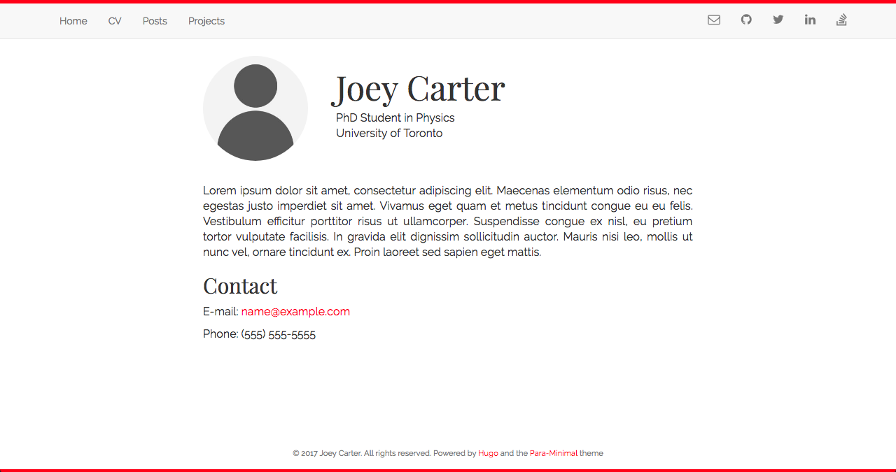

# Para-Minimal

[](https://github.com/joeycarter/para-minimal/blob/master/LICENSE)

An academic and personal blog theme powered by [Hugo](https://gohugo.io), based on the [Minimal](https://github.com/calintat/minimal) theme by [calintat](https://github.com/calintat).



## Installation

You can install the theme either as a clone or submodule. I recommend the latter. From the root of your Hugo site, type the following:

```bash
$ git submodule add https://github.com/joeycarter/para-minimal.git themes/minimal
```

Now you can get updates to Para-Minimal in the future by updating the submodule:

```bash
$ git submodule update --remote themes/para-minimal
```

or simply by navigating to `themes/para-minimal` and doing a `git pull`.

## Configuration

After installation, take a look at the `exampleSite` directory inside `themes/para-minimal`.

To get started, copy the `config.toml` file inside `exampleSite` to the root of your Hugo site:

```bash
$ cp themes/minimal/exampleSite/config.toml .
```

Now edit this file and add your own information. Note that some fields can be ommited.

I recommend you use the theme's archetypes, so you can delete your site's `archetypes/default.md`.

## Features

You can tweak the look of the theme to suit your needs in a number of ways:

- The accent colour can be changed by using the `accent` field in `config.toml`.

- You can also change the background colour by using `backgroundColor`.

- Add colored 5px borders at the top and bottom of pages by setting `showBorder` to `true`.

Personally I prefer a dark accent colour with a light background, for example:

```toml
[params]
    accent = "red"
    showBorder = true
    backgroundColor = "white"
```

### Fonts

The theme uses [Google Fonts](https://fonts.google.com) to load its font. To change the font, edit the following in your config file:

```toml
[params]
    font = "Open Sans" # should match the name on Google Fonts!
```

### Syntax highlighting

The theme supports syntax highlighting thanks to [highlight.js](https://highlightjs.org), which is enabled by default. To disable syntax highlting, set `highlight` to `false` in your config file.

You can change the style used for the highlighting by using the `highlightStyle` field.

Only the "common" languages will be loaded by default. To load more, use `highlightLanguages`.

A list of all the available styles and languages can be found [here](https://highlightjs.org/static/demo/).

Please note the style and languages should be written in hyphen-separated lowercase, for example:

```toml
[params]
    highlight = true
    highlightStyle = "solarized-dark"
    highlightLanguages = ["go", "haskell", "kotlin", "scala", "swift"]
```

## Adding and Editing Content

All of your content (with a few exceptions) goes in `content/`. There are a few different types of content that you can include in your website using this theme:

### The Homepage

To create your homepage, copy `themes/para-minimal/layouts/index.html` to `layouts/index.html` and edit as you see fit. To add your avatar, place an image in `static/img/` and edit the image path in `index.html`.

To add a short blurb about yourself on you homepage, write this in `content/_index.md`.

### "Information" Pages

These are pages that contain information about you, such as your CV or research interests, that require different format from a blog post.

These pages are written in Markdown as always, and go directly in `content/`. In the header section, add the following lines:

```yaml
type: "info"
disableComments: true
```

### Posts

Blog posts go in `content/post/`. To create a new blog post, use hugo:

```bash
$ hugo new post/my-blog-post.md
```

This creates a new Markdown file with the header pulled from the template in `themes/para-minimal/archetypes/post.md`.
